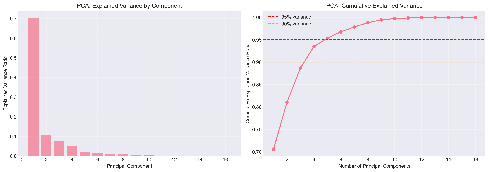
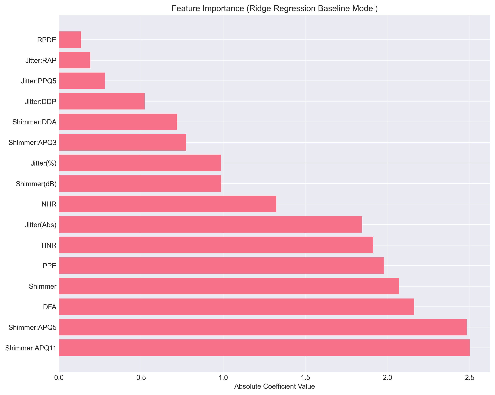

# Predicting motor UPDRS from voice: a dimensionality reduction study

Can you estimate a Parkinson's patient's motor symptom score from the acoustic
properties of their voice alone? This compares PCA and UMAP as dimensionality
reduction front-ends to a Ridge regression on the Oxford Parkinson's
Telemonitoring dataset, 5,875 voice recordings from 42 patients, each labelled
with a clinician's motor UPDRS score.

Coursework for SYDE 572 (Pattern Recognition).

## The result

**The answer is essentially no, not with these features and a linear model.**

| Method | Components | Test RMSE | Test R² |
|---|---|---|---|
| All 16 voice features (baseline) | 16 | 7.681 | 0.076 |
| PCA | 15 | 7.681 | 0.076 |
| UMAP | 7 | 7.706 | 0.073 |

R² of 0.076 means roughly **8 % of the variance in motor UPDRS is explained**.
Neither reduction method beats the baseline in any meaningful sense, PCA at 15
components reproduces it to four decimal places, which is what you would expect
given that 15 components capture essentially 100 % of the variance of 16
standardised features. The honest summary is that dimensionality reduction
neither helped nor hurt, because there was very little linear signal to
preserve or destroy in the first place.

That is a real finding rather than a failed experiment, and it is the useful
thing this project shows: the comparison between PCA and UMAP is only
interesting once something is actually predictable, and a near-zero R² makes
the two methods indistinguishable.



PC1 alone accounts for 70.6 % of the variance. That is not a sign that the
problem is easy, it reflects how correlated the features are. The jitter
measures (`Jitter(%)`, `Jitter:RAP`, `Jitter:PPQ5`, `Jitter:DDP`) are largely
different normalisations of the same cycle-to-cycle period perturbation, and
the shimmer measures likewise for amplitude. There are nowhere near 16
independent things being measured here.



The largest coefficients are shimmer (amplitude perturbation) and DFA, PPE and
HNR, the nonlinear and noise-ratio measures. Note that coefficients this
correlated cannot be read individually as importance: with features this
collinear, the split of weight between `Shimmer:APQ11` (+2.50) and
`Shimmer:APQ5` (-2.48) is near-arbitrary and would move substantially under
resampling.

## Caveats, read these before citing the numbers

- **The split is not subject-wise.** `train_test_split` is applied at the
  recording level, so recordings from the *same patient* appear in both train
  and test. With ~140 recordings per patient, that is leakage, and the reported
  R² is an optimistic bound. A `GroupShuffleSplit` on `subject#` is the correct
  design and would likely read lower still. This is the single biggest thing
  to fix.
- **Linear model only.** The original authors of this dataset reached
  substantially better accuracy with nonlinear regressors (CART ensembles).
  A Ridge baseline is the right control for a dimensionality-reduction
  comparison, but "voice cannot predict UPDRS" is not a conclusion this
  supports, only "voice cannot *linearly* predict UPDRS from these 16
  features."
- **UMAP for regression is unusual.** UMAP optimises for preserving local
  neighbourhood structure for visualisation; it makes no promise that the
  embedding is a good regression basis, and it does not preserve global
  distances. Treat the UMAP row as an experiment, not a recommendation.
- **UPDRS is a clinician's subjective rating.** Its own inter-rater
  variability puts a ceiling on any achievable R².

## Running it

```bash
pip install -r requirements.txt
jupyter notebook final.ipynb
```

## Data

Oxford Parkinson's Disease Telemonitoring Dataset, UCI ML Repository,
5,875 recordings, 42 patients, 16 voice features plus age, sex and test time.

> Tsanas, A., Little, M.A., McSharry, P.E., Ramig, L.O. Accurate telemonitoring
> of Parkinson's disease progression by non-invasive speech tests.
> *IEEE Transactions on Biomedical Engineering*, 2010.

## License

MIT, see [LICENSE](LICENSE). The dataset is from the UCI ML Repository and
carries its own terms.
